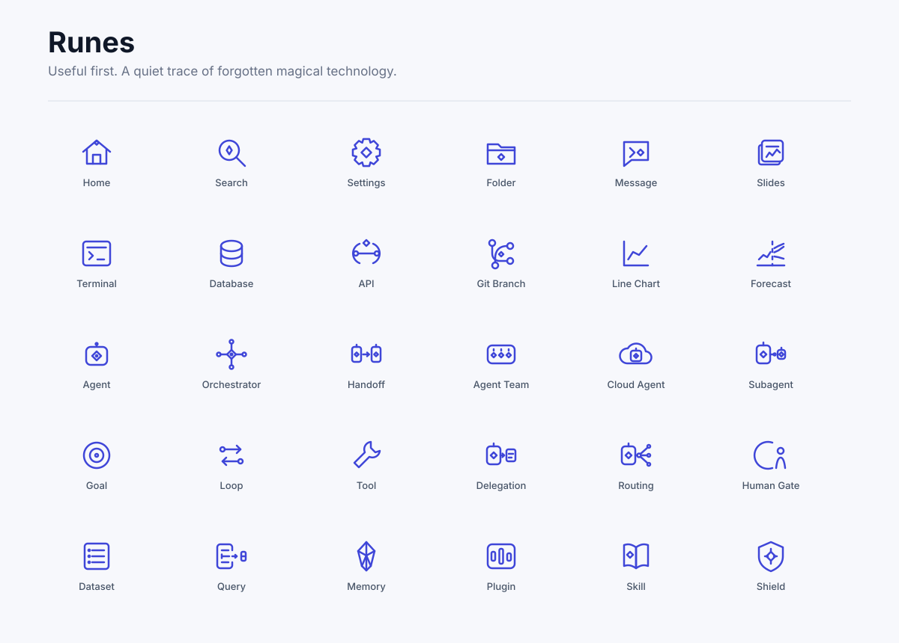

# Runes

Runes is a set of 438 SVG icons for product interfaces, software diagrams, data work, and AI agent systems.

**Runes is an agent-ready visual language.** AI agents can reuse and extend a consistent icon system instead of redesigning every asset from scratch.

The included CLI makes that language operational: agents can search by meaning and export the same reviewed SVG or PNG assets directly into their work.

The icons are designed to be useful first. Familiar shapes carry the meaning, while a small trace of forgotten magical technology gives the set its character.

> **Preview:** Runes is still being refined. Names and drawings may change before the first stable release.

**[Browse all 438 icons in the live gallery →](https://gotalab.github.io/runes-icons/)**

Search by name or meaning, adjust the preview, copy SVG code, or download SVG and PNG files directly from the browser.



## What is included

- Everyday interface icons such as search, settings, folders, messages, and editing tools
- Software and development icons such as terminals, databases, APIs, Git, testing, and deployment
- AI and agent icons such as agents, handoffs, tools, memory, context, evaluation, and safety
- Data and analytics icons such as datasets, queries, pipelines, charts, forecasts, retention, and churn
- Icons for presentations, media, devices, security, payments, and navigation

All icons share a `24 × 24` drawing area. They use outlines by default and inherit the surrounding text color, so size, color, and line width can be changed without editing the drawing.

## Browse the icons

The [live searchable gallery](https://gotalab.github.io/runes-icons/) is published with GitHub Pages. You can also run the same gallery locally:

```sh
pnpm install
pnpm dev
```

The gallery shows every icon from 16px to 128px. It also lets you change line width, colors, light and dark backgrounds, and the visible icon group. Select any icon to copy its SVG or download SVG and PNG files with the current preview settings.

## Use from the terminal

The package is not published to npm yet. From this repository, the included command can search and export icons:

```sh
node bin/runes.mjs search "agent delegation" --limit 5
node bin/runes.mjs info handoff
node bin/runes.mjs export handoff --format svg --out ./handoff.svg
node bin/runes.mjs export handoff --format png --size 128 --out ./handoff.png
```

Use `--json` when another program needs to read the result. Export commands require an output path and will not replace a different file unless `--force` is passed.

The complete set can also be exported as Iconify JSON:

```sh
node bin/runes.mjs export-set --format iconify-json --out ./gotalab-runes.json
```

## Color

SVG exports use `currentColor`, just like many common interface icon sets. An inline SVG therefore follows the CSS `color` of its parent.

Runes also supports optional secondary and tertiary colors for icons whose parts have a real visual role. Every icon remains readable in one color.

## How the source is organized

Each icon belongs to one small file under `src/icons/`. Shared rules for size, line width, naming, search, and related meanings live in `src/`.

Change an icon only in its source family file. Generated SVG files and agent-plugin bundles are outputs, not editable sources.

The visual language, visual grammar, semantic grammar, and system rules are documented in [ICON_LANGUAGE.md](ICON_LANGUAGE.md).

## Checks

Run the full check before committing a change:

```sh
pnpm check
```

The checks catch repeatable problems such as duplicate names, invalid SVG parts, drawings outside the canvas, stale exports, broken search names, and unexpected pixel changes. Visual review at 128px, 24px, and 16px is still required because software cannot decide whether an icon looks balanced or communicates clearly.

## Status and releases

- Current version: `0.2.2` preview
- Live gallery: [gotalab.github.io/runes-icons](https://gotalab.github.io/runes-icons/)
- Source repository: the only place where icon drawings are edited
- npm and framework packages: planned, not published

## License

The code and original icon designs are licensed under [MIT](LICENSE) © 2026 Gotalab.
